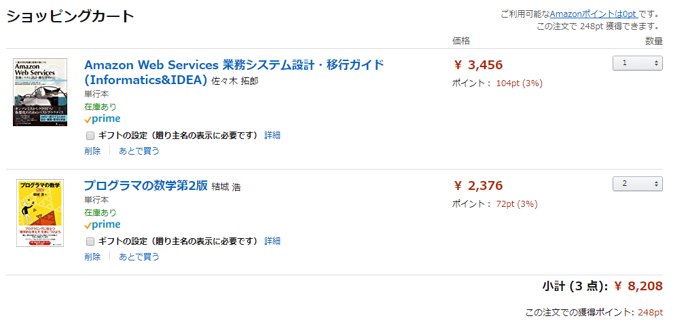

amazonのショッピングカート画面を想定

# 設問
src以下のクラスをリファクタリングしてください。

* パフォーマンスチューニングは不要
* オブジェクト・ディレクトリ等は自由に作ってOK
* オブジェクト指向を意識する
* 最終的に出力するフォーマットは変更しないこと
* testsも追加実装・リファクタリング等してOK

# 条件

* 1 <= 数量 <= 9
* 0 <= 価格 <= 99999
* 1 <= 商品名の長さ <= 255